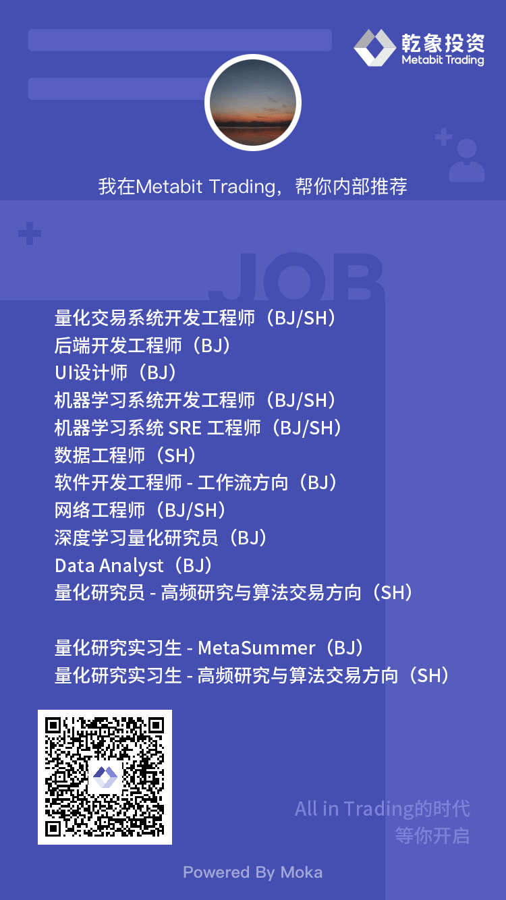

# 乾象投资

## 公司介绍

[乾象投资][metabit] Metabit Trading 成立于 2018 年，是一家以人工智能和机器学习为基础的科技型量化投资公司。「Meta」是数学中「元」的概念，「Bit」是计算机最小存储单位「比特」，「Metabit」代表着数学与计算机语言的完美结合。我们深度融合与改进机器学习算法，并将其应用至信噪比极低的金融数据上，从而为投资人创造长期可持续的回报，进军顶级国际对冲基金。

我们的核心团队来自 Stanford、CMU、Facebook 和 Google 等顶尖高校和公司，25% 的投研和技术团队人员曾获得 ACM ICPC 金牌，具有领先的科研能力和丰富的技术经验。

公司于 2020 年 10 月在基金业协会登记为私募基金管理人；2020 年 12 月，发行第一只私募证券投资基金；2021 年 6 月，管理规模超过 10 亿元人民币；2022 年 12 月，管理规模超过 50 亿元；目前，我们的投资标的已涵盖中国股票、期货，以及香港、美国、欧洲、日本、韩国等国际地区的股票期货市场。

## 内推

* [乾象投资 2024 MetaSummer 训练营报名启动！邀你一起打开量化研究的黑箱！](https://mp.weixin.qq.com/s?__biz=MzI4OTMwMzM1NA==&mid=2247488334&idx=1&sn=f3d8358be2e4c6d4138e533f7064f519&chksm=ec306d1bdb47e40ddc53ac92ead02a5cf14d9397a554d074ad882088b1be7e8b10743c910928&cur_album_id=2289121002234216449&scene=189#wechat_redirect)

<figure markdown>
  { width=420px }
</figure>

* 可以直接扫描图中的二维码进行投递
* 也可以点击 [链接](https://app.mokahr.com/apply/metabit-trading/26108#/jobs) 进行投递，注意投递简历的时候需要填写我的内推码：NTA2yCq
* 也可以将简历发给我，帮您投递，顺便可以帮您润色一下简历
* 成功入职后，内推奖励平分
* 联系方式：
    * QQ/WX: [Duplicate4](/images/wechat.jpg)
    * Email: lyuzhi.pan@metabit-trading.com

[metabit]: https://metabit-trading.com/
