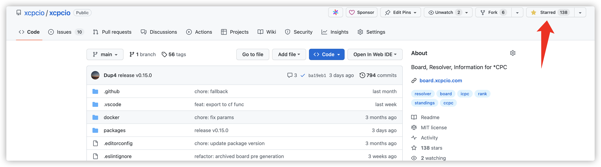
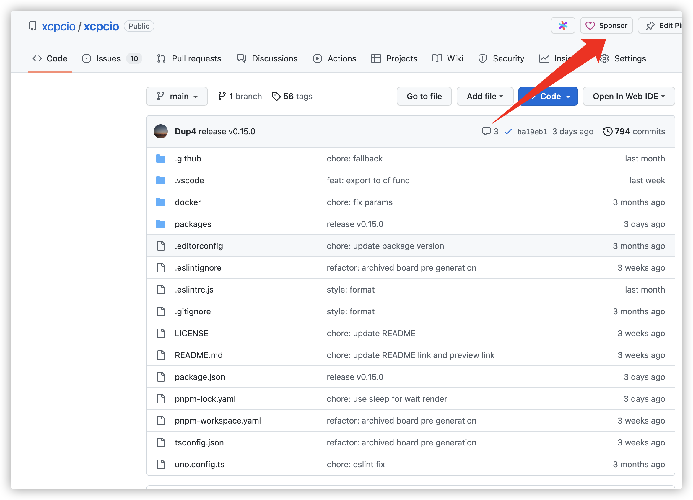

# Sponsor

因为要维持 [xcpcio][gh-xcpcio] 项目的持续运行，每年需要投入一定的费用，比如于域名、服务器等费用，以及一些人力成本。

如果您喜欢 [xcpcio][gh-xcpcio] 这个项目，欢迎您通过各种方式支持我们。

## GitHub Star

如果喜欢 [xcpcio][gh-xcpcio] 这个项目，欢迎给我们的 [GitHub Repo][gh-xcpcio] 点一个小小的 Star，您的一个小小 Star，就是我们的无限动力。

<figure markdown>
  
</figure>

## GitHub Sponsor

我们也支持 [GitHub Sponsor][gh-sponsor]，也可以在 [GitHub][gh-xcpcio] 上 [Sponsor][gh-sponsor] 我们。

<figure markdown>
  
</figure>

欢迎您成为我们的 [Sponsors][gh-sponsor].

## AliPay

如果想投喂我们但是又无法通过 GitHub Sponsor 渠道的朋友们，可以通过支付宝投喂我们，可以备注一下 XCPCIO 和您的 GitHub 账号，我们会在 [官网][xcpcio] 中进行感谢。

<figure markdown>
  { width=360px }
</figure>

## Contact us

如果您有一些特别的赞助诉求，欢迎联系我们：

* QQ/WX: [Duplicate4](/images/wechat.jpg)
* <xcpcio@dup4.com>
* <https://github.com/xcpcio/xcpcio/issues>

[xcpcio]: https://xcpcio.com
[gh-xcpcio]: https://github.com/xcpcio/xcpcio
[gh-sponsor]: https://github.com/sponsors/Dup4
